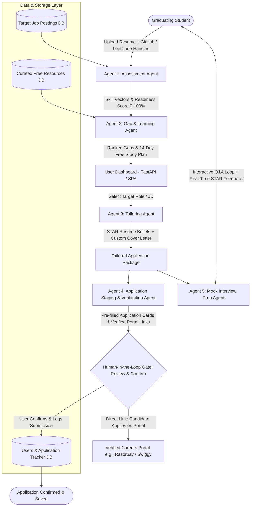

# Product Requirements Document (PRD)

## Project: CareerPilot — Agentic Job-Readiness & Application Copilot

---

### 1. Executive Summary & Vision
**CareerPilot** is an end-to-end, multi-agent AI copilot designed for graduating engineering students. Rather than a superficial form-filler or a generic resume evaluator, CareerPilot orchestrates a stateful 5-agent pipeline that guides a candidate from **Self-Assessment → Targeted Gap Upskilling → Job-Specific Tailoring → Application Staging & Portal Verification → Role-Specific Interview Preparation**.

A foundational design pillar is the **Human-in-the-Loop (HITL) Gate**: the system pre-fills and stages verified application packages (contact info, STAR resume, cover letter, verified career portal links) but requires human review and confirmation before logging submissions. This ensures strict compliance with job portal Terms of Service (ToS), prevents account bans, and enforces responsible AI deployment.

---

### 2. Problem Statement & Target Audience
* **Target Audience**: Graduating engineering students entering competitive tech job markets.
* **Core Pain Points**:
  * **AI Job Anxiety & Blind Spots**: Students lack objective data on how their real projects and profiles map against actual employer requirements.
  * **Generic Application Fatigue**: Mass-applying with identical resumes yields low callback rates; manually customizing each resume and cover letter is too time-consuming.
  * **Fragmented Preparation**: Assessment, resume tailoring, application tracking, and interview prep exist in siloed tools.
  * **Account Ban Risks**: Traditional auto-apply bots violate platform terms (LinkedIn, Naukri) and risk banning the student's primary job accounts.

---

### 3. Architecture & Multi-Agent Workflow

---

### 4. Agent Specifications & Functional Requirements

#### 4.1. Agent 1: Assessment Agent
* **Objective**: Establish the student's true technical baseline and measure semantic alignment against target industry roles.
* **Inputs**:
  * Resume file (`.pdf` or raw text).
  * Public Profile Handles: GitHub username, LeetCode username, LinkedIn URL.
  * Target Role / Domain (e.g., "Backend", "Full Stack", "Frontend", "DevOps / Cloud", "Data / AI", "All").
* **Execution Logic**:
  1. **Resume Parser**: Extracts structured entities (candidate name, email, phone, skills, projects, links) using layout-aware regex and text segmentation.
  2. **Profile Signals Extractor**:
     * GitHub API: Repositories, top programming languages, commit activity, project complexity.
     * LeetCode API / Scraper: Solved count by difficulty (Easy/Medium/Hard).
  3. **Skill Matrix Normalization**: Merges extracted resume skills with languages verified from GitHub.
  4. **JD Benchmarking**: Calculates TF-IDF term frequency and cosine similarity against the curated tech JD benchmark corpus; computes matched vs. missing skills.
* **Output**:
  * Baseline Overall Readiness Score (0–100%).
  * Current Verified Skill Matrix.
  * Role Benchmark Match List.

---

#### 4.2. Agent 2: Gap & Learning Agent
* **Objective**: Identify critical capability deficits based on benchmark market demand and generate a targeted learning roadmap.
* **Inputs**:
  * Verified Skill Matrix (from Agent 1).
  * Target Domain & Curated Benchmark JDs Corpus.
* **Execution Logic**:
  1. **Market Frequency Extraction**: Tokenizes and clusters required technical skills across the target JD dataset; ranks skills by empirical appearance frequency.
  2. **Set-Difference & Gap Detection**: Computes `Target_Market_Skills − Candidate_Verified_Skills`.
  3. **Free Resource Indexing**: Matches missing high-frequency skills with verified free resources:
     * **NPTEL / SWAYAM** (for foundational theory: OS, DBMS, Networks).
     * **High-quality YouTube playlists** (for practical stacks: FastAPI, Docker, Spring Boot).
     * **Official Documentation** (for syntax and quickstarts).
  4. **14-Day Roadmap Assembly**: Distributes high-priority missing skills across a sequential 2-week micro-learning plan.
* **Output**:
  * Ranked Gap Matrix with priority levels (Critical, High, Recommended) and market demand percentage.
  * Structured 14-Day Micro-Learning Plan with direct links to free material.

---

#### 4.3. Agent 3: Tailoring Agent
* **Objective**: Contextualize the applicant's existing experience for a chosen Job Description without hallucinating false credentials.
* **Inputs**:
  * Candidate Profile & Project Database (from Agent 1).
  * Selected Job Description (JD).
* **Execution Logic**:
  1. **JD Keyword & Intent Extraction**: Extracts core responsibilities, tech stack, and evaluation criteria.
  2. **STAR Bullet Rewriter**: Rephrases the candidate's authentic project achievements to highlight relevant JD skills using the **STAR methodology** (Situation, Task, Action, Result) with quantitative metrics.
     * *Guardrail*: Explicit system instruction prohibiting the invention of unlisted tools, companies, or metrics.
  3. **Cover Letter Generator**: Generates a 3-paragraph, role-specific cover letter articulating alignment with the hiring team's stated challenges.
* **Output**:
  * Tailored Resume text / exportable `.pdf` and `.txt` draft.
  * Custom Cover Letter text.

---

#### 4.4. Agent 4: Application Staging & Verification Agent
* **Objective**: Eliminate repetitive application chaos while maintaining strict platform compliance and safety without dangerous auto-filling.
* **Inputs**:
  * Target Job Description (Company, Role, Portal URL, LinkedIn Search URL).
  * Candidate Master Details (contact info, work authorization, notice period).
  * Tailored Resume & Cover Letter (from Agent 3).
* **Execution Logic**:
  1. **Package Structuring**: Compiles pre-filled application summary cards (contact info, role, attached documents, online profiles).
  2. **Portal URL Verification**: Resolves and verifies employer careers portal URLs (e.g. Razorpay, Swiggy, Freshworks) and generates targeted LinkedIn job search links.
  3. **Quick-Apply Bundle Generator**: Formats a 1-click clipboard bundle with cover letter and candidate links.
  4. **Human-in-the-Loop (HITL) Gate**: Halts execution, presenting the pre-filled staging cards to the candidate for review before any portal visit or submission.
  5. **Submission Logging**: When the candidate confirms submission, transitions state to `APPROVED_BY_HUMAN_SUBMITTED`, persisting the application record into the database with timestamps and status tracking.
* **Output**:
  * Staged application package awaiting human confirmation (`STAGED_AWAITING_APPROVAL`).
  * Direct verified links to official careers portals and LinkedIn jobs.
  * Application tracker record upon confirmation.

---

#### 4.5. Agent 5: Mock Interview Prep Agent
* **Objective**: Prepare the candidate for technical and behavioral interviews tailored specifically to the targeted JD.
* **Inputs**:
  * Target JD.
  * Tailored Resume (from Agent 3).
* **Execution Logic**:
  1. **Question Generator**: Synthesizes 5 probable interview questions categorized into:
     * Technical Deep-Dive (based on projects listed on the tailored resume).
     * Concept Testing (based on high-priority JD requirements).
     * Behavioral / Situational (cultural and situational questions relevant to the role level).
  2. **Interactive Mock Session**: Presents questions sequentially through the UI with hints and concept tags.
  3. **Response Evaluation**: Assesses candidate responses on:
     * Technical Accuracy (0–10).
     * Clarity & Structure (STAR alignment) (0–10).
     * Improvement Recommendation & Senior Engineer Model Answer.
* **Output**:
  * Role-specific Question Bank.
  * Post-session Feedback Scorecard with ratings and critiques.

---

### 5. Human-in-the-Loop (HITL) Specification

| Dimension | Autonomous Auto-Submit Bot | CareerPilot HITL Architecture |
| :--- | :--- | :--- |
| **Portal ToS Compliance** | Direct violation of LinkedIn / Naukri anti-bot policies. | Fully compliant: Staged packages assist the student; application on portal is human-conducted. |
| **Account Safety** | High risk of IP blocks, CAPTCHA traps, and permanent account bans. | Safe: No automated keystroke injection into live portals; human handles submission. |
| **Accuracy & Liability** | Hallucinations or misfiled form entries lead to instant rejection. | Zero liability: Candidate reviews all pre-filled answers and uploaded files. |
| **Academic Merit** | Scripting / scraping script. | Responsible AI Engineering: Explores ethical agent boundaries and supervisory control. |

**Enforcement Rule**: The code pipeline state machine explicitly transitions to a terminal paused state (`STAGED_AWAITING_APPROVAL`) until the candidate reviews the package and explicitly confirms submission.

---

### 6. Authentication Gate & Save Enforcement
* **Immediate Auth Gate**: Upon entering the application, visitors are presented with an immediate modal offering strictly three options:
  1. **Log In** (Username or Email + Password).
  2. **Create Account** (Full Name, Username, Email, Password).
  3. **Continue without Login** (Guest Mode).
* **Save Enforcement ("To save info user should log in")**:
  * In Guest Mode, candidates can explore all benchmark roles, skill gap analyses, and mock interview questions.
  * All persistent saving actions (Saving Profile in Tab 1, Confirming Applications in Tab 4) are gated: guest actions prompt the auth modal to log in or register.
  * Passwords are encrypted using SHA-256 hashing.

---

### 7. Technology Stack

| Component | Selected Technology | Rationale |
| :--- | :--- | :--- |
| **Backend Framework** | **FastAPI** (Python 3.10+) | High-performance asynchronous REST API, automatic OpenAPI docs, modular routers. |
| **Multi-Agent Orchestrator** | **Pipeline Orchestrator** (Stateful Pipeline) | Centralized, typed state dictionary (`CareerPilotState`) coordinating data handoffs. |
| **LLM Inference** | **Google Gemini 1.5 Flash** / **Groq (Llama-3.1-70B)** | Fast token generation, high reliability, graceful deterministic fallback. |
| **Similarity & Benchmarking** | **TF-IDF + Cosine Similarity & Skill Overlap** | High-speed, local matching without paid external vector database dependencies. |
| **Frontend UI** | **FastAPI + Jinja2 + Tailwind CSS + Vanilla JS SPA** | Modern responsive single-page architecture, 5-tab stepper, dynamic auth modals. |
| **Database / Persistence** | **MongoDB (Motor)** + **Embedded Document Store Fallback** | Asynchronous document store with local JSON fallback for zero-configuration resilience. |
| **Resume & Profile Parsers** | **Regex & Layout-Aware Text Parser** | Extracts contact info, GitHub/LeetCode/LinkedIn links, and technical skill sets. |
| **Hosting & Deployment** | **Render (Production)** + Uvicorn ASGI Server | Continuous deployment directly from GitHub repository with SSL endpoints. |

---

### 8. Scope Boundaries: In-Scope vs. Out-of-Scope

#### In-Scope (Implemented & Verified Deliverables)
1. Parsing candidate resume + fetching public GitHub/LeetCode statistics.
2. Benchmarking against real tech JDs across Backend, Full Stack, Frontend, Cloud/DevOps, and Data/AI.
3. Calculating frequency-based skill gaps and surfacing verified free courses (NPTEL, YouTube, Docs).
4. Generating tailored STAR resume bullets and custom cover letters via LLM with anti-hallucination guardrails.
5. Staging structured application packages with verified employer portal links and HITL confirmation gate.
6. Mock interview conversational loop with dual scoring (Technical & STAR) and model answers.
7. Authentication gate on entry with save enforcement and MongoDB persistence.

#### Out-of-Scope (Excluded to Avoid Over-Complexity)
* Autonomous CAPTCHA-bypassing bots on third-party portals (violates platform terms and ethics).
* Real-time scraping of third-party job boards (avoids IP blocks, Cloudflare traps, and fragile DOM scrapers; replaced by a robust curated benchmark corpus + verified direct portal links and dynamic LinkedIn search).
* Paid enterprise integrations (Workday private APIs, Greenhouse internal endpoints).
* Video/speech emotion recognition (audio/speech analysis adds unnecessary complexity; text-based Q&A is academically robust).

---

### 9. Academic Evaluation & Viva Defense Highlights

1. **Natural Language Processing (NLP)**: Entity extraction, section segmentation, and semantic normalization on resumes.
2. **Information Retrieval & Similarity Matching**: Cosine similarity matching between candidate skill vectors and multi-document job descriptions.
3. **Multi-Agent Orchestration**: Stateful pipeline with shared context, conditional routing, and deterministic state transitions.
4. **Responsible AI Design (HITL)**: Ethical engineering addressing Terms of Service constraints, preventing automated spam, and establishing human supervisory control.
5. **Full-Stack Resilient Architecture**: Dual-layer database design (MongoDB with embedded fallback) and secure authentication.
