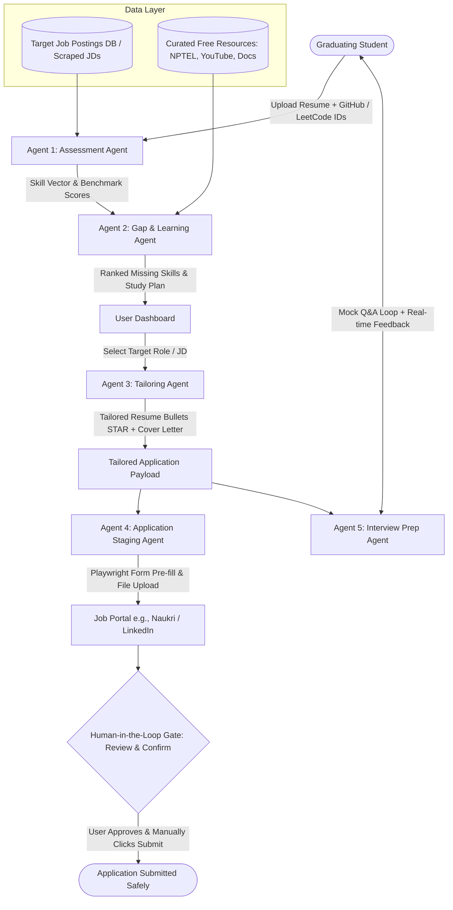

# Product Requirements Document (PRD)

## Project: CareerPilot — Agentic Job-Readiness & Application Copilot

---

### 1. Executive Summary & Vision
**CareerPilot** is an end-to-end, multi-agent AI copilot designed for graduating engineering students. Rather than a superficial form-filler or a generic resume evaluator, CareerPilot orchestrates a stateful 5-agent pipeline that guides a candidate from **Self-Assessment → Targeted Gap Upskilling → Job-Specific Tailoring → Staged Application Automation → Role-Specific Interview Preparation**.

A foundational design pillar is the **Human-in-the-Loop (HITL) Approval Gate**: the system pre-fills and stages job applications via browser automation but stops prior to submission. This ensures strict compliance with job portal Terms of Service (ToS), prevents account bans, and enforces responsible AI deployment.

---

### 2. Problem Statement & Target Audience
* **Target Audience**: Graduating engineering students entering competitive tech job markets.
* **Core Pain Points**:
  * **AI Job Anxiety & Blind Spots**: Students lack objective data on how their real projects and profiles map against actual employer requirements.
  * **Generic Application Fatigue**: Mass-applying with identical resumes yields low callback rates; manually customizing each resume and cover letter is too time-consuming.
  * **Fragmented Preparation**: Assessment, resume tailoring, application tracking, and interview prep exist in siloed tools.
  * **Account Ban Risks**: Traditional auto-apply bots violate platform terms (LinkedIn, Naukri) and risk banning the student's primary job accounts.

---

### 3. Architecture & Multi-Agent Workflow



---

### 4. Agent Specifications & Functional Requirements

#### 4.1. Agent 1: Assessment Agent
* **Objective**: Establish the student's true technical baseline and measure semantic alignment against target industry roles.
* **Inputs**:
  * Resume file (`.pdf` or `.docx`).
  * Public Profile Handles: GitHub username, LeetCode username.
  * Target Role / Domain (e.g., "Junior Backend Engineer", "Full Stack Developer - Bangalore").
* **Execution Logic**:
  1. **Resume Parser**: Extracts structured entities (skills, projects, work experience, education) using a lightweight layout-aware text parser.
  2. **Profile Extractor**:
     * GitHub API: Repositories, top languages, commit frequency, project complexity (stars, dependencies).
     * LeetCode API / Public Scraper: Solved count by difficulty (Easy/Medium/Hard), contest rating.
  3. **Skill Vector Generator**: Creates a weighted embedding representation of the candidate's verified skills.
  4. **JD Benchmarking**: Calculates cosine similarity against a curated/scraped corpus of live job postings for the designated target role and location.
* **Output**:
  * Baseline Readiness Score (0–100%).
  * Current Verified Skill Matrix (Languages, Frameworks, Core CS, System Design).

---

#### 4.2. Agent 2: Gap & Learning Agent
* **Objective**: Identify critical capability deficits based on live market demand and generate a targeted learning roadmap.
* **Inputs**:
  * Verified Skill Matrix (from Agent 1).
  * Corpus of Target JDs (from Agent 1).
* **Execution Logic**:
  1. **Market Frequency Extraction**: Tokenizes and clusters required technical skills across the target JD dataset; ranks skills by empirical appearance frequency.
  2. **Set-Difference & Gap Detection**: Computes `Target_Market_Skills - Candidate_Verified_Skills`.
  3. **Free Resource Indexing**: Matches missing high-frequency skills with verified free resources:
     * **NPTEL / SWAYAM** (for foundational theory: OS, DBMS, Networks).
     * **High-quality YouTube playlists** (for practical stacks: FastAPI, Docker, Spring Boot).
     * **Official Documentation** (for syntax and quickstarts).
* **Output**:
  * Ranked Gap Matrix: Skills sorted by impact score (`Demand_Frequency * Inverted_Difficulty`).
  * Actionable 7–14 Day Micro-Learning Plan with direct links to free material.

---

#### 4.3. Agent 3: Tailoring Agent
* **Objective**: Contextualize the applicant's existing experience for a chosen Job Description without hallucinating false credentials.
* **Inputs**:
  * Candidate Profile & Project Database (from Agent 1).
  * Selected Job Description (JD).
* **Execution Logic**:
  1. **JD Keyword & Intent Extraction**: Extracts core responsibilities, tech stack, and evaluation criteria.
  2. **STAR Bullet Rewriter**: Rephrases the candidate's authentic project achievements to highlight relevant JD skills using the **STAR methodology** (Situation, Task, Action, Result) with quantitative metrics.
     * *Guardrail*: Explicit system instruction prohibiting the invention of unlisted tools, companies, or metrics.
  3. **Cover Letter Generator**: Generates a 3-paragraph, role-specific cover letter articulating alignment with the hiring team's stated challenges.
* **Output**:
  * Tailored Resume text / exportable `.pdf` draft.
  * Custom Cover Letter text.

---

#### 4.4. Agent 4: Application Staging Agent (Innovative Core)
* **Objective**: Eliminate repetitive application data entry using browser automation while maintaining strict platform compliance and safety.
* **Inputs**:
  * Target Job Portal URL (e.g., Naukri / LinkedIn Easy Apply / Greenhouse).
  * Candidate Master Details (contact info, work authorization, education).
  * Tailored Resume & Cover Letter (from Agent 3).
* **Execution Logic**:
  1. **Browser Automation Engine (Playwright)**: Launches a controlled browser session (headed or user-visible debugging port).
  2. **Form Field Mapping**: Identifies standard input fields (Name, Phone, Years of Experience, Notice Period, Current CTC/Expected CTC) and populates them.
  3. **Document Attachment**: Uploads the newly generated tailored resume and cover letter.
  4. **Staging & Halting**: Advances multi-step application wizards up to the final confirmation dialog.
  5. **Approval Gate Interruption**: Halts execution immediately before triggering any action labeled "Submit", "Apply Now", or "Send Application".
* **Output**:
  * Staged browser state awaiting human confirmation.
  * Status log sent to User Dashboard: "Application staged at [Portal URL] — Please review and click Submit."

---

#### 4.5. Agent 5: Interview Prep Agent
* **Objective**: Prepare the candidate for technical and behavioral interviews tailored specifically to the targeted JD.
* **Inputs**:
  * Target JD.
  * Tailored Resume (from Agent 3).
* **Execution Logic**:
  1. **Question Generator**: Synthesizes probable interview questions categorized into:
     * Technical Deep-Dive (based on projects listed on the tailored resume).
     * Concept Testing (based on high-priority JD requirements).
     * Behavioral / Situational (cultural and situational questions relevant to the role level).
  2. **Interactive Mock Session**: Presents questions sequentially through the UI.
  3. **Response Evaluation**: Assesses candidate responses on:
     * Technical Accuracy (0–10).
     * Clarity & Structure (STAR alignment) (0–10).
     * Improvement Recommendation & Model Answer snippet.
* **Output**:
  * Role-specific Question Bank.
  * Post-session Feedback Scorecard.

---

### 5. Human-in-the-Loop (HITL) Specification

| Dimension | Autonomous Auto-Submit Bot | CareerPilot HITL Architecture |
| :--- | :--- | :--- |
| **Portal ToS Compliance** | Direct violation of LinkedIn / Naukri anti-bot policies. | Fully compliant: Automation serves as an assistant; final transaction is human-executed. |
| **Account Safety** | High risk of IP blocks, CAPTCHA traps, and permanent account bans. | Safe: Browser actions mimic assistive typing; human handles any 2FA/CAPTCHA. |
| **Accuracy & Liability** | Hallucinations or misfiled form entries lead to instant rejection. | Zero liability: Candidate reviews all pre-filled answers and uploaded files. |
| **Academic Merit** | Scripting/scraping script. | Responsible AI Engineering: Explores ethical agent boundaries and supervisory control. |

**Enforcement Rule**: The code pipeline state machine explicitly transitions to a terminal paused state (`AWAITING_USER_APPROVAL`) before any destructive/irreversible HTTP POST or button click.

---

### 6. System State & Data Flow (LangGraph State Schema)

To keep execution deterministic, modular, and maintainable, agents communicate via a unified, typed state dictionary:

```python
class CareerPilotState(TypedDict):
    # Candidate Baseline
    raw_resume_text: str
    github_handle: str
    leetcode_handle: str
    verified_skills: list[str]
    readiness_score: float

    # Market & Gap Analysis
    target_role: str
    target_jds: list[dict]          # [{"title": str, "company": str, "description": str, "url": str}]
    ranked_skill_gaps: list[dict]   # [{"skill": str, "frequency": int, "resources": list[str]}]

    # Tailored Application Artifacts
    active_jd: dict
    tailored_resume_bullets: list[str]
    tailored_cover_letter: str

    # Application Staging
    staging_status: str             # "IDLE" | "IN_PROGRESS" | "STAGED_AWAITING_APPROVAL" | "COMPLETED"
    portal_url: str

    # Interview Prep
    mock_history: list[dict]        # [{"question": str, "answer": str, "feedback": str, "score": int}]
```

---

### 7. Pragmatic Technology Stack (Zero-Cost / Free-Tier)

To ensure smooth execution without prohibitive infrastructure or API costs:

| Component | Selected Technology | Rationale |
| :--- | :--- | :--- |
| **Agent Framework** | **LangGraph** (Python) | Clear state graphs, native support for human-in-the-loop checkpoints and pauses. |
| **LLM Inference** | **Google Gemini 1.5 Flash** / **Groq (Llama-3-70B/8B)** | Generous free tier quotas, high token processing speed, zero cost. |
| **Embeddings & Vector Store** | **ChromaDB (local)** + `all-MiniLM-L6-v2` | Runs locally in-memory/file; requires no paid vector database subscription. |
| **Browser Automation** | **Playwright (Python)** | Modern async browser automation, robust selector handling, handles dynamic SPAs. |
| **Document Parsing** | **PyPDF2 / pdfplumber** | Lightweight local text and layout extraction from resume PDFs. |
| **Frontend UI** | **Streamlit** | Rapid single-file or multi-page dashboard development; minimal frontend boilerplate. |
| **Storage / Cache** | **SQLite** | Zero-config, single-file relational persistence for profiles, JDs, and session logs. |

---

### 8. Scope Boundaries: In-Scope vs. Out-of-Scope

#### In-Scope (Deliverables for Complete Working Prototype)
1. Parsing student resume + fetching public GitHub/LeetCode stats.
2. Benchmarking against a sample dataset of 15–20 real JDs for a designated target role.
3. Calculating frequency-based skill gaps and surfacing verified free courses (NPTEL, YouTube, Docs).
4. Generating tailored STAR resume bullets and custom cover letters via LLM.
5. Playwright automation script demonstrating form pre-filling on a demo form / portal sandbox and pausing at review.
6. Mock interview conversational loop with scoring and feedback.
7. Integrated Streamlit UI connecting all 5 agents.

#### Out-of-Scope (Excluded to Avoid Over-Complexity)
* Fully autonomous CAPTCHA-bypassing engines (counterproductive and violates ethics).
* Scraping 10,000+ live portals on the fly (a targeted dataset or static cache of 20–50 real postings prevents rate-limit roadblocks).
* Paid enterprise integrations (Workday private APIs, Greenhouse internal endpoints).
* Video/speech emotion recognition (audio/speech analysis adds unnecessary complexity; text-based Q&A is academically robust).

---

### 9. Academic Evaluation & Viva Defense Highlights

When presenting to evaluators, CareerPilot demonstrates mastery across 5 distinct domains of computer science:

1. **Natural Language Processing (NLP)**: Entity extraction, section segmentation, and semantic normalization on resumes.
2. **Information Retrieval & Vector Embeddings**: Cosine similarity matching between candidate skill vectors and multi-document job descriptions.
3. **Multi-Agent Orchestration**: Stateful pipeline with shared context, conditional routing, and deterministic graph transitions using LangGraph.
4. **Browser & Process Automation**: Resilient DOM querying, asynchronous wait strategies, and session management via Playwright.
5. **Responsible AI Design (HITL)**: Ethical engineering addressing Terms of Service constraints, preventing automated spam, and establishing human supervisory control.

