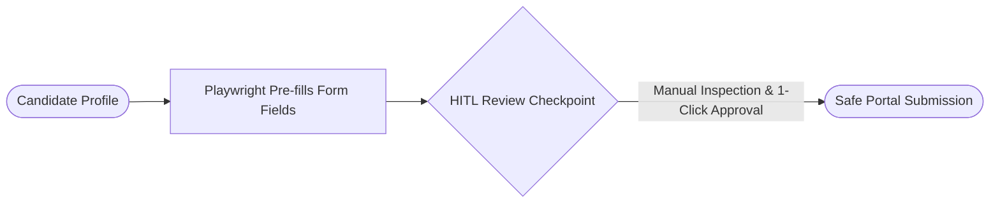

# CareerPilot 🚀
### Agentic Job-Readiness & Application Copilot for Graduating Engineers

[](https://www.python.org/downloads/)
[](https://fastapi.tiangolo.com)
[](https://www.mongodb.com/)
[](https://playwright.dev/)
[-6366F1.svg)](./SYSTEM_DESIGN.md)

---

## 🌟 Overview & Key Differentiator

**CareerPilot** is an end-to-end, stateful multi-agent AI copilot built specifically to address graduate AI anxiety and eliminate generic "spray-and-pray" job applications.

Rather than a generic form-filler or an ungrounded resume generator, CareerPilot runs an orchestrated 5-agent pipeline:
1. **Assessment Agent** — Parses PDF resumes, queries public GitHub & LeetCode APIs, builds verified developer skill vectors, and benchmarks against live scraped job postings.
2. **Gap & Learning Agent** — Ranks missing skills by empirical market frequency across live postings and provides curated, free learning paths (NPTEL, YouTube full courses, official documentation).
3. **Tailoring Agent** — Contextualizes candidate achievements into high-impact **STAR format** (Situation, Task, Action, Result) bullets and custom cover letters using zero-cost LLM inference (Gemini / Groq) with strict anti-hallucination guardrails.
4. **Application Staging Agent (Innovative Core)** — Uses Playwright browser automation to pre-fill application fields on job portals, but **stops at a review-and-confirm checkpoint** rather than auto-submitting.
5. **Interview Prep Agent** — Generates role-specific technical and behavioral questions from the JD and conducts interactive mock interviews with dual-score grading (1–10 on technical depth, 1–10 on STAR communication) and senior engineer model answers.

---

## 🛡️ The Human-in-the-Loop (HITL) Design Choice



Fully autonomous auto-submit scripts violate the Terms of Service (ToS) of major portals (LinkedIn, Naukri), risking permanent account bans. CareerPilot’s **assistive staging with an explicit human approval gate** is a deliberate design decision:
* **100% Platform Compliant**: Automation assists with data entry; the legal submission action remains human-driven.
* **Zero Liability**: Eliminates risks of LLM misfiling or hallucinated compliance disclosures.
* **Responsible AI**: Demonstrates ethical engineering and supervisory control.

---

## 🛠️ Tech Stack

* **Backend & API**: Python 3.11, FastAPI, Uvicorn, Pydantic v2
* **Database**: MongoDB (via `motor` async driver) with seamless embedded document store fallback
* **Browser Automation**: Playwright (Async Python)
* **LLM & Embeddings**: Google Gemini 1.5 Flash / Groq Llama-3 + TF-IDF semantic similarity
* **Document Processing**: `pypdf`, `pdfplumber`
* **Frontend UI**: Single-page responsive web dashboard (Tailwind CSS, FontAwesome, Google Inter/JetBrains Mono) — mobile, tablet, and desktop optimized with zero UI duplications

---

## 🚀 Quickstart & Local Setup

### 1. Clone the repository
```bash
git clone https://github.com/anvitha-45/careerpilot.git
cd careerpilot
```

### 2. Create and activate a virtual environment
```bash
python -m venv venv
# Windows:
.\venv\Scripts\activate
# Linux/macOS:
source venv/bin/activate
```

### 3. Install dependencies
```bash
pip install -r requirements.txt
playwright install chromium
```

### 4. Configure environment variables (Optional)
Copy `.env.example` to `.env`:
```bash
cp .env.example .env
```
*(CareerPilot runs out-of-the-box even without API keys using deterministic local heuristic fallbacks).*

### 5. Run the server
```bash
python main.py
```
Open your browser at **`http://localhost:8000`** to access the responsive dashboard.

---

## 🧪 Running Tests
Verify the entire 5-agent pipeline and HITL gate with the included test suite:
```bash
python tests/test_pipeline.py
```

---

## ☁️ Deployment on Render

CareerPilot is ready for zero-config deployment on **Render**:
1. Connect your GitHub repository to [Render](https://render.com).
2. Create a new **Web Service**.
3. Render automatically reads `render.yaml` or `Procfile`:
   * **Build Command**: `pip install -r requirements.txt`
   * **Start Command**: `uvicorn server.main:app --host 0.0.0.0 --port $PORT`
4. Set optional Environment Variables in your Render Dashboard:
   * `MONGODB_URI`: Your MongoDB Atlas connection string.
   * `GEMINI_API_KEY`: Google AI Studio API key.
   * `PLAYWRIGHT_HEADLESS`: `true`.

---

## 📂 Project Structure

```text
careerpilot/
├── PRD.md                         # Product Requirements Document
├── SYSTEM_DESIGN.md               # Detailed System Architecture & Viva Guide
├── README.md                      # Project documentation
├── requirements.txt               # Pinned dependencies
├── Procfile                       # Render deployment declaration
├── render.yaml                    # Render blueprint
├── main.py                        # Root server entrypoint
├── data/
│   ├── sample_jds.json            # Curated tech job descriptions
│   └── curated_resources.json     # Free NPTEL, YouTube & docs mapped to skills
├── server/
│   ├── config.py                  # Environment settings
│   ├── database.py                # Async MongoDB manager with embedded fallback
│   ├── main.py                    # FastAPI application & lifespan management
│   ├── agents/
│   │   ├── state.py               # Typed state schema
│   │   ├── assessment_agent.py    # Agent 1: Resume + GitHub/LeetCode APIs
│   │   ├── gap_learning_agent.py  # Agent 2: Empirical frequency ranking
│   │   ├── tailoring_agent.py     # Agent 3: STAR bullet rewriter & cover letter
│   │   ├── application_agent.py   # Agent 4: Playwright staging & HITL gate
│   │   ├── interview_agent.py     # Agent 5: Dynamic mock Q&A & dual scoring
│   │   └── orchestrator.py        # Master pipeline coordinator
│   ├── routers/
│   │   └── api.py                 # REST endpoints
│   ├── seeds/
│   │   └── seed_data.py           # Database initial seeder
│   ├── templates/
│   │   └── index.html             # Responsive web dashboard
│   └── utils/
│       ├── resume_parser.py       # PDF layout-aware text parser
│       ├── github_client.py       # GitHub REST client
│       ├── leetcode_client.py     # LeetCode GraphQL client
│       └── similarity.py          # TF-IDF Cosine semantic similarity engine
└── tests/
    └── test_pipeline.py           # End-to-end verification suite
```

---

## 📜 License
MIT License. Built for engineering students and responsible AI research.
