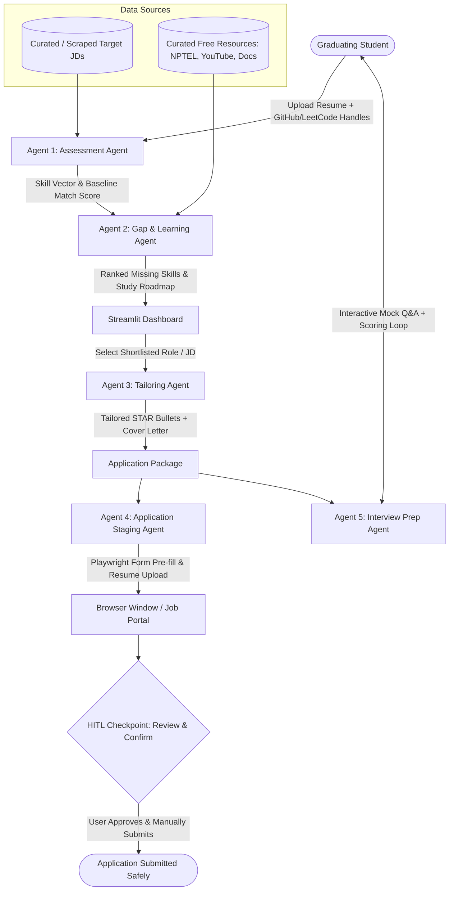

# CareerPilot: System Design, Architecture & Implementation Document

---

## 1. Executive Summary & Vision

**CareerPilot** is an orchestrated, stateful multi-agent AI copilot designed for graduating engineers. Rather than a superficial form-filler or an ungrounded resume generator, CareerPilot operationalizes an end-to-end pipeline:
1. **Self-Assessment** (Resume + GitHub/LeetCode APIs benchmarking against live job markets)
2. **Targeted Upskilling** (Frequency-ranked skill gaps mapped to free, verified resources)
3. **Application Tailoring** (STAR-format resume contextualization & custom cover letters via zero-cost LLM inference)
4. **Staged Automation** (Browser-driven form population with a strict **Human-in-the-Loop** checkpoint)
5. **Interview Preparation** (JD-grounded technical & behavioral mock sessions with scoring)

### The Core Architectural Differentiator: Human-in-the-Loop (HITL) Gate
Unlike fragile auto-apply bots that violate portal Terms of Service (ToS) and risk permanent account bans on LinkedIn or Naukri, CareerPilot automates repetitive data entry and document staging, then **halts execution at a review-and-confirm checkpoint**. The candidate validates the pre-filled inputs and clicks "Submit" manually. This converts a legally dubious bot into an ethical, responsible AI productivity tool.

---

## 2. Multi-Agent Pipeline & State Architecture

CareerPilot models the job readiness and application lifecycle as a deterministic, stateful directed graph using **LangGraph**.



### Shared State Schema (`agents/state.py`)
Each node in the LangGraph pipeline consumes and writes to a central, strongly-typed state dictionary:

```python
from typing import TypedDict, List, Dict, Any, Optional

class CareerPilotState(TypedDict):
    # Candidate Baseline Data
    raw_resume_text: str
    parsed_skills: List[str]
    github_handle: Optional[str]
    github_stats: Dict[str, Any]      # Top languages, repo count, commit frequency
    leetcode_handle: Optional[str]
    leetcode_stats: Dict[str, Any]    # Easy/Medium/Hard solved count, contest rating
    verified_skill_vector: List[float]
    readiness_score: float            # 0.0 to 100.0%

    # Market Intelligence & Gap Analysis
    target_role: str
    target_region: str
    target_jds: List[Dict[str, Any]]  # [{"id": str, "title": str, "company": str, "skills": list, "text": str}]
    ranked_skill_gaps: List[Dict[str, Any]] # [{"skill": str, "market_frequency": int, "resources": list}]

    # Job Tailoring Artifacts
    active_jd_id: str
    tailored_resume_bullets: List[str] # Structured STAR bullets grounded in real candidate projects
    tailored_cover_letter: str

    # Application Staging & HITL
    portal_url: str
    staging_status: str               # "NOT_STARTED" | "STAGED_AWAITING_APPROVAL" | "USER_APPROVED"
    staged_fields: Dict[str, str]

    # Interview Preparation Loop
    mock_questions: List[Dict[str, Any]] # [{"id": int, "question": str, "category": str, "expected_concepts": list}]
    mock_history: List[Dict[str, Any]]   # [{"question_id": int, "user_answer": str, "score": int, "feedback": str}]
```

---

## 3. Deep-Dive: The 5 Autonomous Agent Modules

### Module 1: Assessment Agent (`agents/assessment_agent.py`)
* **Purpose**: Parse raw artifacts into verified developer signals and benchmark against real industry expectations.
* **Component Pipeline**:
  1. **Resume Parser (`utils/resume_parser.py`)**: Uses `pypdf` / `pdfplumber` to extract structured sections (Projects, Work History, Education, Technical Skills).
  2. **GitHub Signal Extractor (`utils/github_client.py`)**:
     * Queries the public GitHub REST API (`https://api.github.com/users/{username}/repos`).
     * Aggregates primary programming languages, repository star counts, commit activity, and dependency trees.
  3. **LeetCode Signal Extractor (`utils/leetcode_client.py`)**:
     * Hits the public LeetCode GraphQL endpoint (`https://leetcode.com/graphql`).
     * Extracts solved problem counts partitioned into `Easy`, `Medium`, `Hard`, and contest percentiles.
  4. **Skill Vector Generator & Cosine Benchmarker**:
     * Embeds the combined candidate profile using a lightweight local embedding model (`sentence-transformers/all-MiniLM-L6-v2`).
     * Computes cosine similarity against vectorized requirements of target role JDs.
* **Output**: Verified technical skill inventory and an objective baseline Readiness Score (0–100%).

---

### Module 2: Gap & Learning Agent (`agents/gap_learning_agent.py`)
* **Purpose**: Eliminate student confusion by ranking missing skills by actual employer demand and providing curated, free learning paths.
* **Component Pipeline**:
  1. **Empirical Frequency Aggregator**:
     * Tokenizes and extracts technical entities from the target JD corpus.
     * Counts occurrence frequency (e.g., Docker appears in 85% of backend listings, Kafka in 60%, Redis in 45%).
  2. **Set-Difference Engine**:
     * Identifies `Missing_Skills = Target_JD_Skills - Candidate_Verified_Skills`.
     * Calculates an Impact Score: `Priority = (Market_Appearance_Frequency) * (Domain_Relevance_Weight)`.
  3. **Curated Resource Matcher**:
     * Maps top missing skills to a local database (`data/curated_resources.json`) containing:
       * **NPTEL / SWAYAM**: In-depth academic rigor (Operating Systems, DBMS, Distributed Systems).
       * **Curated YouTube Series**: Hands-on practical stacks (e.g., freeCodeCamp, TechWorld with Nana).
       * **Official Documentation Quickstarts**: Clean reference material.
* **Output**: Ranked skill gap matrix and an actionable 14-day micro-upskilling plan with direct URLs.

---

### Module 3: Tailoring Agent (`agents/tailoring_agent.py`)
* **Purpose**: Optimize candidate presentation for a specific target job without fabricating unearned experience.
* **Component Pipeline**:
  1. **JD Semantic Parsing**: Extracts core problems the hiring team is solving, required tools, and must-have qualifications.
  2. **STAR-Format Project Rewriter**:
     * Transforms authentic candidate project descriptions into high-impact **Situation, Task, Action, Result** bullet points.
     * Highlights technologies that overlap with the JD while maintaining absolute factual grounding.
  3. **Anti-Hallucination Guardrail (Prompt Constraint)**:
     ```text
     STRICT CONSTRAINT: You are forbidden from inventing technologies, metrics, or positions 
     that are not explicitly verified in the Candidate Profile. Highlight genuine achievements 
     using the STAR structure without introducing unlisted frameworks.
     ```
  4. **Custom Cover Letter Generator**: Synthesizes a structured 3-paragraph cover letter outlining candidate motivations and direct project alignment.
* **Output**: Exportable tailored resume text and customized cover letter.

---

### Module 4: Application Staging Agent (`agents/application_agent.py`)
* **Purpose**: Automate manual form entry on hiring portals while enforcing safe, ethical human confirmation.
* **Component Pipeline**:
  1. **Playwright Automation Engine**:
     * Launches a visible browser instance (`headless=False`) using a persistent user profile context (retaining logins and cookies).
     * Connects to the designated portal application URL (e.g., LinkedIn Easy Apply, Greenhouse, Naukri).
  2. **Intelligent Form Field Mapper**:
     * Uses resilient selector cascades (ARIA labels, IDs, input types) to pre-fill:
       * Full Name, Email, Phone Number.
       * Work Authorization & Location Preferences.
       * GitHub, LeetCode, and LinkedIn Profile URLs.
       * Years of Experience / Graduation Year.
  3. **Document Uploader**: Automatically attaches the newly generated tailored resume PDF.
  4. **The HITL Breakpoint (Interrupt Before Submit)**:
     * Advances multi-step forms until reaching the final "Review Application" screen.
     * Code halts immediately before firing any DOM click on elements matching `Submit`, `Apply Now`, or `Send Application`.
     * Signals the dashboard: *"Application successfully staged. Please inspect your information and click Submit."*
* **Output**: Staged application ready for user review and manual submission.

---

### Module 5: Interview Prep Agent (`agents/interview_agent.py`)
* **Purpose**: Convert job descriptions and tailored project bullets into dynamic, role-specific technical and behavioral mock interviews.
* **Component Pipeline**:
  1. **Question Synthesis**:
     * Generates 5 technical deep-dive questions based on the candidate's tailored resume projects.
     * Generates 3 core conceptual questions derived directly from the high-priority skills in the JD.
     * Generates 2 behavioral questions tailored to junior engineer scenarios.
  2. **Interactive Evaluation Engine**:
     * Takes candidate's written or recorded response for each question.
     * Scores on two 10-point scales:
       * **Technical Correctness & Depth (1–10)**
       * **Communication & STAR Alignment (1–10)**
     * Provides an actionable critique and a concise model answer snippet.
* **Output**: Live interactive mock interview session and post-interview diagnostic scorecard.

---

## 4. Human-in-the-Loop (HITL) Engineering & Ethics

### Why Auto-Submit Bots are an Anti-Pattern
1. **Terms of Service (ToS) Violations**: Section 8 of LinkedIn's User Agreement and Naukri's Terms strictly forbid automated bots, crawlers, or scraping scripts. Accounts executing autonomous submits face rapid shadow-banning or permanent IP/account suspension.
2. **Hallucination Liability**: If an LLM hallucinates an answer to a compliance question (e.g., *"Do you require visa sponsorship?"*), an unreviewed auto-submit can disqualify the applicant instantly.
3. **Bot Detection Traps**: Cloudflare and PerimeterX detect programmatic submissions via canvas fingerprinting and timing analysis.

### The CareerPilot Solution
By anchoring the design around **Assistive Staging rather than Autonomous Submission**, CareerPilot operates within legal boundaries:
* Automation performs assistive data entry under user supervision.
* The final legal declaration and submission action remains human-executed.
* In LangGraph, this is represented by an explicit checkpoint: `graph.add_node("hitl_gate", interrupt_before=True)`.

---

## 5. Technology Stack & Zero-Cost Infrastructure

| Layer | Technology | Cost | Architectural Role |
| :--- | :--- | :--- | :--- |
| **Agent Orchestration** | **LangGraph** (Python) | $0 | Deterministic state graph, cyclic loops, native HITL breakpoints |
| **LLM Inference** | **Google Gemini 1.5 Flash** / **Groq Llama-3** | $0 (Free Tier) | Low-latency token generation, bullet rewriting, Q&A evaluation |
| **Embeddings & Vector Store** | `all-MiniLM-L6-v2` + **ChromaDB** | $0 (Local) | In-memory semantic search and skill vector similarity matching |
| **Browser Automation** | **Playwright** (Python) | $0 (Open Source) | Form pre-filling, dynamic DOM interaction, file uploads |
| **Document Processing** | `pypdf` + `pdfplumber` | $0 (Open Source) | High-speed local PDF parsing and entity extraction |
| **Frontend UI** | **Streamlit** | $0 (Open Source) | Reactive single-dashboard web interface for all 5 agents |
| **Persistence** | **SQLite** | $0 (Built-in) | Local session history, target JD storage, mock interview logs |

---

## 6. Project Directory Layout

```text
Careerpilot/
├── PRD.md                         # Product requirements & high-level specification
├── SYSTEM_DESIGN.md               # Complete architectural & technical specification
├── requirements.txt               # Pinned Python package dependencies
├── .env.example                   # Template for API keys (GEMINI_API_KEY, GROQ_API_KEY)
├── app.py                         # Main Streamlit Dashboard UI
├── config.py                      # Global configuration and environment settings
├── data/
│   ├── sample_jds.json            # Curated corpus of real target job postings
│   └── curated_resources.json     # Free NPTEL, YouTube & docs mapped by skill
├── agents/
│   ├── __init__.py
│   ├── state.py                   # Central TypedDict state schema
│   ├── assessment_agent.py        # Agent 1: Resume + GitHub/LeetCode APIs + Benchmark
│   ├── gap_learning_agent.py      # Agent 2: Frequency ranking + Resource mapping
│   ├── tailoring_agent.py         # Agent 3: STAR bullet rewriter + Cover Letter (LLM)
│   ├── application_agent.py       # Agent 4: Playwright browser staging + HITL gate
│   └── interview_agent.py         # Agent 5: Role-specific mock Q&A + feedback loop
├── graph.py                       # LangGraph state machine linking all agents
└── utils/
    ├── resume_parser.py           # Local PDF extractor
    ├── github_client.py           # GitHub REST API client
    ├── leetcode_client.py         # LeetCode GraphQL client
    └── vector_store.py            # Local ChromaDB & embedding utility
```

---

## 7. 7-Day Implementation Roadmap

```text
Phase 1: Project Scaffolding & Public APIs (Day 1)
  ├── Setup virtual environment & requirements.txt
  ├── Build utils/resume_parser.py (PDF text extraction)
  ├── Build utils/github_client.py & utils/leetcode_client.py
  └── Create data/sample_jds.json & data/curated_resources.json

Phase 2: Agent 1 (Assessment) & Agent 2 (Gap Analysis) (Day 2)
  ├── Implement agents/assessment_agent.py (Embedding & Cosine Scoring)
  ├── Implement agents/gap_learning_agent.py (Empirical frequency calculation)
  └── Unit test assessment and gap ranking via CLI

Phase 3: Agent 3 (Tailoring with Free LLM) (Day 3)
  ├── Configure Gemini 1.5 Flash / Groq client
  ├── Implement agents/tailoring_agent.py (STAR prompt guardrails)
  └── Test resume bullet rewriting & cover letter generation

Phase 4: Agent 4 (Application Staging & HITL) (Day 4)
  ├── Implement agents/application_agent.py with Playwright
  ├── Create demo application form sandbox to test form pre-fills
  └── Enforce pause-at-review approval gate

Phase 5: Agent 5 (Interview Prep Mock Loop) (Day 5)
  ├── Implement agents/interview_agent.py (Question generator & grading rubric)
  └── Test interactive Q&A loop with simulated answers

Phase 6: LangGraph Integration (Day 6)
  ├── Assemble graph.py connecting Agent 1 -> Agent 2 -> Agent 3 -> Agent 4 -> Agent 5
  └── Validate state persistence across agent handoffs

Phase 7: Streamlit Dashboard & Interview Polish (Day 7)
  ├── Build 4-tab Streamlit dashboard in app.py
  └── Run end-to-end user testing and finalize interview pitch
```

---

## 8. Interview Defense & Academic Viva Guide

### The 60-Second Elevator Pitch
> *"Engineering students face intense job search anxiety and often resort to mass 'spray-and-pray' applications, while traditional auto-apply bots violate platform terms of service and risk permanent account bans. I built **CareerPilot**, an orchestrated multi-agent copilot using LangGraph. It runs a stateful 5-agent pipeline: it parses the student's resume and verifies real coding activity via GitHub and LeetCode APIs, benchmarks their skill vector against real job descriptions, ranks missing skills by empirical market frequency with free NPTEL resources, rewrites project bullets in STAR format using Gemini Flash, pre-fills portal applications via Playwright while pausing for human review, and conducts role-specific mock interviews. Our key architectural differentiator is the Human-in-the-Loop gate—ensuring 100% compliance with job portal policies while demonstrating ethical, responsible AI design."*

### Key Technical Viva Questions & Answers

#### Q1: "Why use a multi-agent framework like LangGraph instead of a single prompt or linear chain?"
* **Answer**: *"A single prompt suffers from context window dilution, cannot coordinate heterogeneous tasks (like REST APIs, vector math, and browser automation), and lacks deterministic state management. Linear chains (like standard LangChain pipelines) cannot handle loops, conditional rollbacks, or human pauses. LangGraph models the system as a directed cyclic graph where each agent is an isolated node with strong error boundaries, explicit state passing, and native support for Human-in-the-Loop interrupts before destructive actions."*

#### Q2: "How do you prevent the Tailoring Agent from fabricating skills or metrics?"
* **Answer**: *"We apply strict grounding constraints in the system prompt: the LLM is given only the candidate-verified project repository from Agent 1 and the target JD. The prompt enforces negative constraints: it permits rephrasing authentic experience into STAR format, but explicitly prohibits adding unverified frameworks, third-party libraries, or invented metrics. In production, we also run a deterministic post-generation check to verify that no new capitalized technical entities were introduced."*

#### Q3: "How does the Playwright agent handle authentication and bot detection on job portals?"
* **Answer**: *"Rather than running headless scrapers that attempt automated logins with stored passwords—which immediately triggers CAPTCHAs and security challenges—CareerPilot launches a visible browser connected to a persistent user context. The student remains authenticated using their own session cookies, solves any 2FA or CAPTCHA manually, and the agent acts as an in-browser assistive copilot."*
