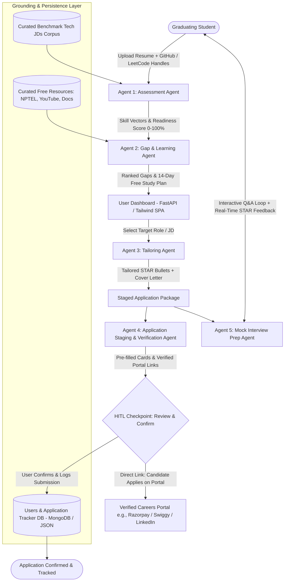

# CareerPilot: System Design, Architecture & Implementation Document

---

## 1. Executive Summary & Vision

**CareerPilot** is an orchestrated, stateful multi-agent AI copilot designed for graduating engineers. Rather than a superficial form-filler or an ungrounded resume generator, CareerPilot operationalizes an end-to-end pipeline:
1. **Self-Assessment**: Resume layout parsing + GitHub/LeetCode public signal extraction, benchmarked against a curated corpus of real industry Job Descriptions (JDs).
2. **Targeted Upskilling**: Frequency-ranked skill gaps mapped to free, verified educational resources (NPTEL, high-yield YouTube series, official documentation).
3. **Application Tailoring**: Context-aware STAR-format resume bullet points & custom cover letters with strict anti-hallucination prompt guardrails.
4. **Staged Application Packaging**: Pre-filled structured application cards, verified career portal links, and a strict **Human-in-the-Loop (HITL)** verification gate.
5. **Interview Preparation**: Role-grounded technical & behavioral mock sessions with dual scoring (Technical Depth & STAR Structure) and model answers.

### The Core Architectural Differentiator: Human-in-the-Loop (HITL) Gate
Unlike fragile auto-apply bots that violate portal Terms of Service (ToS) and risk permanent account bans on LinkedIn or Naukri, CareerPilot automates candidate artifact preparation and staging, then **halts execution at a review-and-confirm checkpoint**. The candidate validates the staged inputs, opens the verified employer career portal, applies with full transparency, and confirms the submission on the dashboard. This converts a legally dubious bot into an ethical, responsible AI productivity tool.

---

## 2. Multi-Agent Pipeline & State Architecture

CareerPilot models the job readiness and application lifecycle as a deterministic, stateful pipeline coordinated by the `PipelineOrchestrator`.



### Shared State Schema (`server/agents/state.py`)
The pipeline agents communicate and hand off data via a strongly-typed state schema:

```python
from typing import TypedDict, List, Dict, Any, Optional

class CareerPilotState(TypedDict):
    # Candidate Baseline Data
    raw_resume_text: str
    parsed_skills: List[str]
    github_handle: Optional[str]
    github_stats: Dict[str, Any]      # Top languages, repo count, commit frequency
    leetcode_handle: Optional[str]
    leetcode_stats: Dict[str, Any]    # Easy/Medium/Hard solved count, contest rating
    verified_skill_vector: List[float]
    readiness_score: float            # 0.0 to 100.0%

    # Benchmark Market Intelligence & Gap Analysis
    target_role: str
    target_domain: str
    target_jds: List[Dict[str, Any]]  # Benchmark JDs: title, company, skills, location, url
    ranked_skill_gaps: List[Dict[str, Any]] # [{"skill": str, "market_demand_percentage": float, "resources": list}]

    # Job Tailoring Artifacts
    active_jd_id: str
    tailored_resume_bullets: List[str] # Structured STAR bullets grounded in real candidate projects
    tailored_cover_letter: str

    # Application Staging & HITL
    portal_url: str
    staging_status: str               # "IDLE" | "STAGED_AWAITING_APPROVAL" | "APPLIED"
    staged_fields: Dict[str, str]

    # Interview Preparation Loop
    mock_questions: List[Dict[str, Any]] # [{"id": int, "question": str, "category": str}]
    mock_history: List[Dict[str, Any]]   # [{"question": str, "user_answer": str, "score": int, "feedback": str}]
```

---

## 3. Deep-Dive: The 5 Autonomous Agent Modules

### Module 1: Assessment Agent (`server/agents/assessment_agent.py`)
* **Purpose**: Parse raw artifacts into verified developer signals and benchmark against real industry expectations.
* **Component Pipeline**:
  1. **Resume Parser (`server/utils/resume_parser.py`)**: Uses layout-aware regex and section segmentation to extract contact info, skills, project titles, and descriptions.
  2. **GitHub Signal Extractor (`server/utils/github_client.py`)**:
     * Queries the public GitHub REST API (`https://api.github.com/users/{username}/repos`).
     * Aggregates primary programming languages, public repo count, star counts, and commit frequency.
  3. **LeetCode Signal Extractor (`server/utils/leetcode_client.py`)**:
     * Queries the public LeetCode GraphQL API endpoint (`https://leetcode.com/graphql`).
     * Extracts solved problem counts partitioned into `Easy`, `Medium`, and `Hard`.
  4. **Skill Vector Generator & Similarity Benchmarker (`server/utils/similarity.py`)**:
     * Uses TF-IDF term frequency and cosine similarity to match the candidate against the curated benchmark JD corpus.
     * Evaluates skill overlap and calculates an objective baseline Readiness Score (0–100%).
  5. **Custom Job Posting Link Ingestor (`server/utils/job_extractor.py`)**:
     * Allows candidates to input direct URLs to any live job posting (LinkedIn, Greenhouse, Lever, company career portals) or paste raw JD text.
     * Fetches HTML content, extracts technical requirements and metadata via LLM/heuristics, and computes real-time readiness.
* **Output**: Verified technical skill inventory, benchmark matches, custom job analysis, and baseline Readiness Score.

---

### Module 2: Gap & Learning Agent (`server/agents/gap_learning_agent.py`)
* **Purpose**: Eliminate student confusion by ranking missing skills by actual employer demand and providing curated, free learning paths.
* **Component Pipeline**:
  1. **Empirical Frequency Aggregator**:
     * Tokenizes and extracts technical entities from the target domain's benchmark JD corpus.
     * Counts appearance frequency across job listings in Backend, Frontend, Full Stack, Cloud, and Data tracks.
  2. **Set-Difference Engine**:
     * Identifies `Missing_Skills = Target_JD_Skills − Candidate_Verified_Skills`.
     * Calculates market prevalence percentage: `Prevalence = (Count / Total_JDs) * 100`.
     * Assigns priority: `Critical` ($\ge 60\%$), `High` ($\ge 40\%$), or `Recommended`.
  3. **Curated Resource Matcher**:
     * Maps top missing skills to a verified database (`data/curated_resources.json`) containing:
       * **NPTEL / SWAYAM**: In-depth academic rigor (Operating Systems, DBMS, Distributed Systems).
       * **Curated YouTube Series**: Practical stacks (freeCodeCamp, Traversy Media, etc.).
       * **Official Documentation Quickstarts**: Clean primary documentation reference material.
  4. **14-Day Micro-Learning Roadmap**:
     * Structures top 4 high-priority missing skills into a sequential 2-week actionable plan.
* **Output**: Ranked skill gap matrix and an actionable 14-day micro-upskilling plan with direct URLs.

---

### Module 3: Tailoring Agent (`server/agents/tailoring_agent.py`)
* **Purpose**: Optimize candidate presentation for a specific target job without fabricating unearned experience.
* **Component Pipeline**:
  1. **JD Semantic Parsing**: Extracts core problems the hiring team is solving, required tools, and must-have qualifications.
  2. **STAR-Format Project Rewriter**:
     * Transforms authentic candidate project descriptions into high-impact **Situation, Task, Action, Result** bullet points.
     * Highlights technologies that overlap with the target JD while maintaining absolute factual grounding.
  3. **Anti-Hallucination Guardrail (Prompt Constraint)**:
     ```text
     STRICT ANTI-HALLUCINATION CONSTRAINT:
     You are strictly forbidden from inventing tools, unverified frameworks, or fake corporate experience.
     Only rephrase and emphasize projects that are factually present in the candidate's verified profile.
     ```
  4. **Custom Cover Letter Generator**: Synthesizes a structured 3-paragraph cover letter outlining candidate motivations and direct project alignment.
* **Output**: Exportable tailored STAR resume bullet points and customized cover letter.

---

### Module 4: Application Staging & Verification Agent (`server/agents/application_agent.py`)
* **Purpose**: Package application materials, verify official employer career portal links, and enforce safe human review.
* **Component Pipeline**:
  1. **Application Staging Card Assembly**:
     * Formats verified candidate fields (Full Name, Email, Phone, GitHub, LeetCode, LinkedIn, ATS STAR bullets, Cover Letter).
     * Prepares 1-click clipboard quick-copy snippets for rapid manual submission.
  2. **Portal URL Verification & Live Job Search Resolver**:
     * Resolves verified direct career URLs for top employers (e.g., `https://razorpay.com/jobs/`, `https://careers.swiggy.com/`).
     * Dynamically constructs pre-populated LinkedIn Job Search queries (`https://www.linkedin.com/jobs/search/?keywords=...`) targeting live openings for the role.
  3. **The HITL Breakpoint (Interrupt Before Submit)**:
     * Enforces human verification: the candidate reviews all staged fields and downloads their tailored resume.
     * Candidate clicks the verified link to apply directly on the employer portal.
     * Candidate marks "I have submitted on the official portal" to officially log the submission into the tracking database.
* **Output**: Staged application package, verified portal deep-links, and logged application record.

---

### Module 5: Interview Prep Agent (`server/agents/interview_agent.py`)
* **Purpose**: Convert job descriptions and tailored project bullets into dynamic, role-specific technical and behavioral mock interviews.
* **Component Pipeline**:
  1. **Question Synthesis**:
     * Generates technical deep-dive questions based on the candidate's tailored resume projects.
     * Generates core conceptual questions derived directly from the high-priority skills in the target JD.
     * Generates behavioral questions tailored to junior engineer scenarios.
  2. **Interactive Evaluation Engine**:
     * Evaluates candidate's written response for each question using dual 10-point scoring:
       * **Technical Correctness & Depth (1–10)**
       * **Communication & STAR Alignment (1–10)**
     * Delivers an actionable critique, identified strengths, weaknesses, and a concise model answer snippet.
* **Output**: Interactive mock interview session and post-interview diagnostic scorecard.

---

## 4. Human-in-the-Loop (HITL) Engineering & Ethics

### Why Auto-Submit Bots are an Anti-Pattern
1. **Terms of Service (ToS) Violations**: Section 8 of LinkedIn's User Agreement and Naukri's Terms strictly forbid automated bots, crawlers, or scraping scripts. Accounts executing autonomous submits face rapid shadow-banning or permanent IP/account suspension.
2. **Hallucination Liability**: If an LLM hallucinates an answer to a compliance question (e.g., *"Do you require visa sponsorship?"*), an unreviewed auto-submit can disqualify the applicant instantly.
3. **Bot Detection Traps**: Cloudflare and PerimeterX detect programmatic submissions via canvas fingerprinting and timing analysis.

### The CareerPilot Solution
By anchoring the design around **Assistive Staging rather than Autonomous Submission**, CareerPilot operates within legal boundaries:
* Automation performs assistive preparation under candidate supervision.
* The final submission action remains human-executed.
* The system enforces an explicit review gate before marking applications as completed in the database.

---

## 5. Technology Stack & Architecture

| Layer | Selected Technology | Architectural Role |
| :--- | :--- | :--- |
| **Backend Framework** | **FastAPI** (Python 3.10+) | High-performance asynchronous REST API, modular routers, OpenAPI docs |
| **Multi-Agent Orchestration** | **Pipeline Orchestrator** | Centralized, typed state management coordinating 5 specialized agents |
| **LLM Inference** | **Google Gemini 1.5 Flash** / **Groq Llama-3.1-70B** | Low-latency token generation, STAR rewriting, interview grading |
| **Similarity & Benchmarking** | **TF-IDF + Cosine Similarity & Skill Overlap** | In-memory deterministic matching against curated benchmark JDs |
| **Frontend UI** | **FastAPI + Jinja2 + Tailwind CSS SPA** | Reactive single-page application with 5-tab stepper and auth modal |
| **Database / Persistence** | **MongoDB (Motor)** + **Embedded JSON Fallback** | Asynchronous document store with zero-configuration fallback |
| **Hosting & Deployment** | **Render (Production)** + Uvicorn ASGI | Continuous deployment directly from GitHub repository with SSL endpoints |

---

## 6. Project Directory Layout

```text
Careerpilot/
├── PRD.md                         # Product Requirements Document
├── SYSTEM_DESIGN.md               # Complete architectural & technical specification
├── careerpilot_architecture.drawio# Draw.io XML visual architecture diagram
├── data/
│   ├── sample_jds.json            # Curated corpus of verified tech benchmark JDs
│   ├── curated_resources.json     # Free NPTEL, YouTube & official docs mapped by skill
│   └── local_db.json              # Local fallback database store
├── server/
│   ├── config.py                  # Global settings and environment configuration
│   ├── database.py                # Dual MongoDB / Embedded JSON document layer
│   ├── main.py                    # FastAPI application entry point & lifespan handler
│   ├── requirements.txt           # Python dependencies
│   ├── agents/
│   │   ├── __init__.py
│   │   ├── state.py               # Shared TypedDict pipeline state schema
│   │   ├── orchestrator.py        # Central multi-agent coordinator
│   │   ├── assessment_agent.py    # Agent 1: Resume parser + GitHub/LeetCode APIs + Benchmarking
│   │   ├── gap_learning_agent.py  # Agent 2: Frequency gap analysis + 14-day roadmap
│   │   ├── tailoring_agent.py     # Agent 3: STAR bullet rewriter + Cover Letter (LLM)
│   │   ├── application_agent.py   # Agent 4: Application staging + verified portal links + HITL gate
│   │   └── interview_agent.py     # Agent 5: Mock technical & STAR interview evaluation
│   ├── routers/
│   │   ├── __init__.py
│   │   └── api.py                 # REST API endpoints (auth, assessment, tailoring, apps, interview)
│   ├── seeds/
│   │   └── seed_data.py           # Initial database seeder for benchmark JDs
│   ├── templates/
│   │   └── index.html             # Tailwind CSS single-page application UI
│   └── utils/
│       ├── __init__.py
│       ├── resume_parser.py       # Layout-aware resume text and entity extractor
│       ├── github_client.py       # Public GitHub API client
│       ├── leetcode_client.py     # Public LeetCode GraphQL client
│       └── similarity.py          # TF-IDF cosine similarity & scoring engine
```

---

## 7. Interview Defense & Academic Viva Guide

### The 60-Second Elevator Pitch
> *"Engineering students face intense job search anxiety and often resort to mass 'spray-and-pray' applications, while traditional auto-apply bots violate platform terms of service and risk permanent account bans. I built **CareerPilot**, an orchestrated multi-agent career copilot powered by FastAPI and modern LLMs. It runs a stateful 5-agent pipeline: it parses the student's resume and verifies real coding activity via GitHub and LeetCode APIs, benchmarks their skill vector against a curated corpus of real industry job descriptions, ranks missing skills by empirical market frequency with free NPTEL and documentation resources, rewrites project bullets in STAR format using Gemini Flash with anti-hallucination guardrails, stages pre-filled application packages with verified employer portal links, and conducts role-specific mock interviews with dual technical and STAR scoring. Our key architectural differentiator is the Human-in-the-Loop gate—ensuring 100% compliance with job portal policies while demonstrating ethical, responsible AI design."*

### Key Technical Viva Questions & Answers

#### Q1: "Why does the application use a curated benchmark job dataset instead of scraping live job portals on the fly?"
* **Answer**: *"Real-time scraping of live portals like LinkedIn, Indeed, or Naukri on the fly is fragile and ethically problematic: commercial portals employ Cloudflare bot mitigation, canvas fingerprinting, and strict rate limits that cause unexpected latency spikes, CAPTCHA blocks, and IP bans during live usage. For deterministic, reproducible academic evaluation, CareerPilot uses a curated benchmark corpus of verified tech job descriptions across 5 core engineering tracks. For live applications, rather than scraping unlawfully, CareerPilot dynamically generates verified career portal deep-links and targeted LinkedIn search queries so the candidate applies safely through official channels."*

#### Q2: "How do you prevent the Tailoring Agent from fabricating skills or metrics?"
* **Answer**: *"We apply strict grounding constraints in the system prompt: the LLM is given only the candidate-verified project repository from Agent 1 and the target JD. The prompt enforces negative constraints: it permits rephrasing authentic experience into STAR format, but explicitly prohibits adding unverified frameworks, third-party libraries, or invented metrics."*

#### Q3: "What is the role of the Human-in-the-Loop (HITL) Gate?"
* **Answer**: *"Most auto-apply tools attempt to autonomously submit forms, violating platform Terms of Service (Section 8 of LinkedIn User Agreement). CareerPilot replaces this unsafe mechanism with an assistive staging approach: Agent 4 pre-fills structured cards and provides verified portal links, pausing at the HITL gate. The candidate reviews the prepared package, applies on the official portal, and confirms the submission on the dashboard. This ensures total safety, zero bot ban liability, and complete candidate agency."*
