# CareerPilot AI — Complete System Documentation 🧭
### *Agentic Job-Readiness & Application Copilot for Graduating Engineers*

---

## 📑 Table of Contents
1. [Executive Summary & Problem Statement](#1-executive-summary--problem-statement)
2. [Visual Walkthrough & Live Video](#2-visual-walkthrough--live-video)
3. [Screen-by-Screen Live Visual Tour](#3-screen-by-screen-live-visual-tour)
4. [System Architecture & 5 CS Pillars](#4-system-architecture--5-cs-pillars)
5. [In-Depth Multi-Agent Pipeline Specifications](#5-in-depth-multi-agent-pipeline-specifications)
   - [Agent 1: Assessment Agent (Empirical Skill Vector)](#agent-1-assessment-agent)
   - [Agent 2: Job Matching & Discovery Engine](#agent-2-job-matching--discovery-engine)
   - [Agent 3: Market Gap & Upskilling Agent](#agent-3-market-gap--upskilling-agent)
   - [Agent 4: Resume Tailoring & CAR/STAR Agent](#agent-4-resume-tailoring--carstar-agent)
   - [Agent 5: Application Staging & HITL Review Gate](#agent-5-application-staging--hitl-review-gate)
   - [Agent 6: Mock Interview Simulator](#agent-6-mock-interview-simulator)
6. [ATS Resume PDF Export Engine](#6-ats-resume-pdf-export-engine)
7. [Ethical & Legal Compliance: Human-in-the-Loop (HITL)](#7-ethical--legal-compliance-human-in-the-loop-hitl)
8. [Backend API Reference](#8-backend-api-reference)
9. [Installation, Testing & Running Guide](#9-installation-testing--running-guide)
10. [Academic Viva Defense & Examiner FAQ](#10-academic-viva-defense--examiner-faq)

---

## 1. Executive Summary & Problem Statement

### 🎯 The Challenge: From "AI Anxiety" to AI Empowerment
Graduating computer science and engineering students face two compounding crises in the placement cycle:
1. **The Entry-Level Hiring Freeze & AI Fear**: Widespread narrative that generative AI is eliminating junior software development roles, inducing paralysis and low confidence.
2. **The Asymmetric Application Arms Race**: Students submit 200+ generic applications only to be screened out by automated **Applicant Tracking Systems (ATS)**, while aggressive "auto-apply" bots violate platform Terms of Service (ToS) and get student profiles permanently banned.

### 💡 The Solution: CareerPilot AI
CareerPilot AI flips the equation. Instead of an automated spam bot or a shallow ChatGPT prompt wrapper, CareerPilot provides an **orchestrated multi-agent pipeline** that operates as an intelligent personal placement cell:
- **Ground-Truth Profiling**: Parses real resumes via NLP and corroborates skills against live GitHub repositories and LeetCode problem counts.
- **Empirical Market Gap Analysis**: Ranks missing technologies by their true frequency in active Indian and global job postings, curating 100% free accredited courses (NPTEL, YouTube, Docs).
- **Zero-Hallucination Tailoring**: Rewrites resume bullets into Context-Action-Result (CAR/STAR) statements and programmatically verifies every word against factual candidate data.
- **ATS-Compliant PDF Export**: Generates single-column, clean Helvetica PDF resumes with zero parsing errors.
- **Responsible Browser Staging**: Automates form pre-filling via Playwright but **strictly halts at a Human Review Checkpoint**, respecting platform safety guidelines.
- **JD-Specific Mock Interviews**: Generates company-targeted technical and behavioral questions evaluated against senior engineering rubrics.

---

## 2. Visual Walkthrough & Live Video

CareerPilot AI includes a full live recorded video walkthrough and high-resolution screen captures of the running web platform:

* 🎥 **Full Video Walkthrough**: [`docs/videos/careerpilot_walkthrough.webm`](videos/careerpilot_walkthrough.webm)  
  *(A continuous 1440x900 recorded session demonstrating the tour offer, dashboard, assessment, tailoring, ATS PDF download, and browser staging checkpoint).*

---

## 3. Screen-by-Screen Live Visual Tour

### Screen 1: First-Time Onboarding Tour Offer
When any student or examiner opens the application, CareerPilot automatically offers an interactive product tour to explain the 5 agents and how the copilot works before signing in.

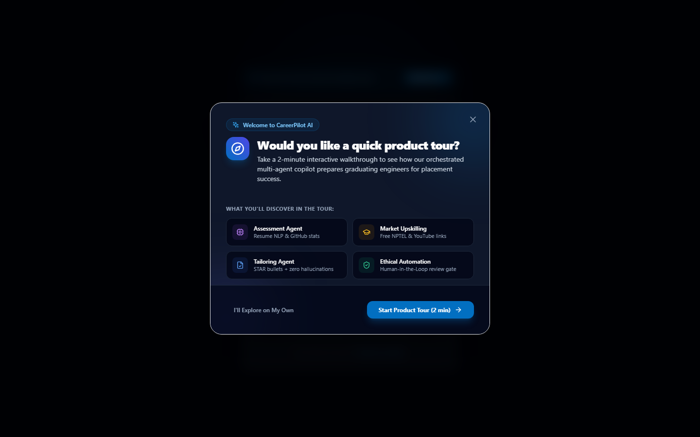

---

### Screen 2: Interactive 8-Step App Tour Modal
A step-by-step interactive walkthrough detailing candidate actions, agent execution, and the unique differentiators of the platform.

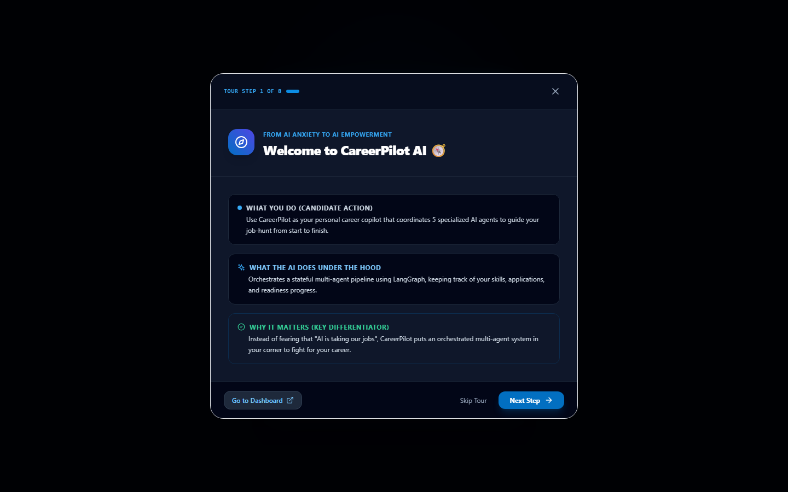

---

### Screen 3: Candidate Login & One-Click Demo Access
Secure JWT authentication with a built-in "One-Click Instant Demo Login" that initializes verified candidate telemetry instantly.

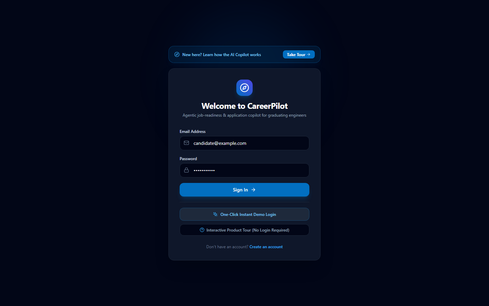

---

### Screen 4: Executive Dashboard & Readiness Gauge
The central mission control displaying the Empirical Readiness Score (0–100%), multi-agent execution pipeline, top matched engineering roles, and urgent market gaps.

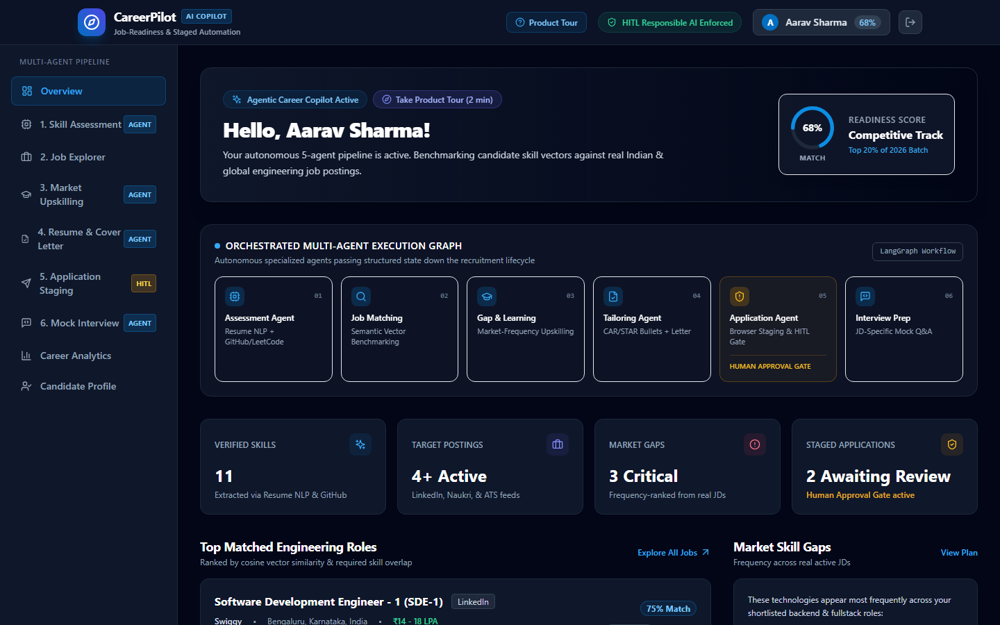

---

### Screen 5: Assessment Agent & Verified Skill Vector
Extracts technical skills across 5 core categories, augmented by public GitHub repositories and LeetCode algorithmic problem-solving telemetry.

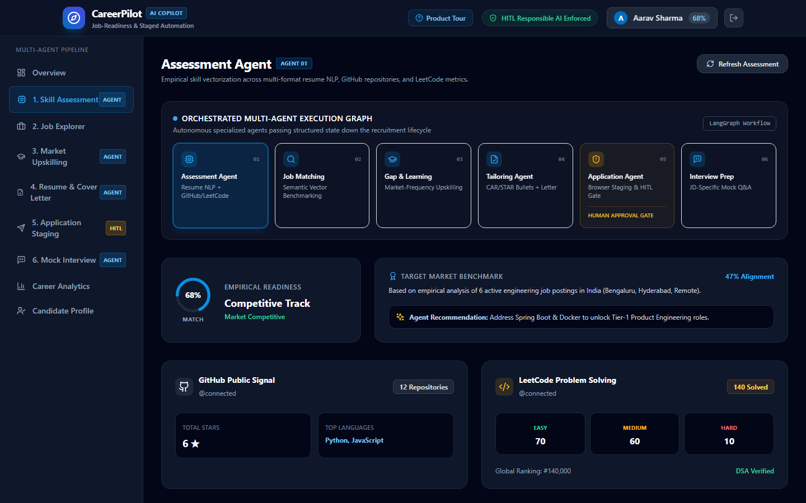

---

### Screen 6: Job Discovery & Semantic Matching Explorer
Ranks active fresher/SDE-1 roles from LinkedIn, Naukri, and ATS portals using multi-factor vector matching and transparent explainability rationale.

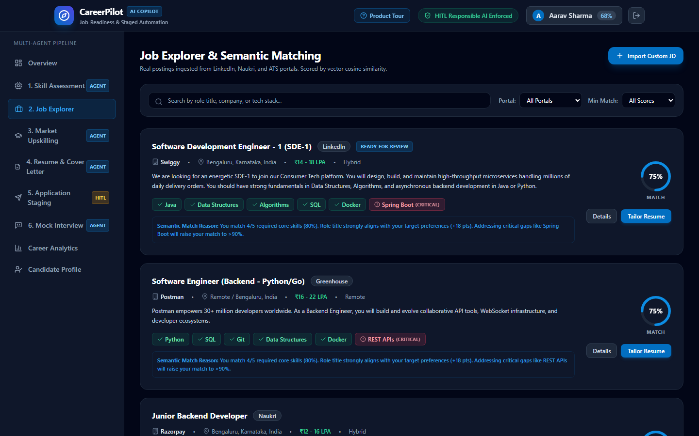

---

### Screen 7: Market Gap & Upskilling Roadmap
Identifies missing skills weighted strictly by real market demand (e.g., "AWS appears in 50% of target backend postings") and pairs each with free NPTEL and developer video playlists.

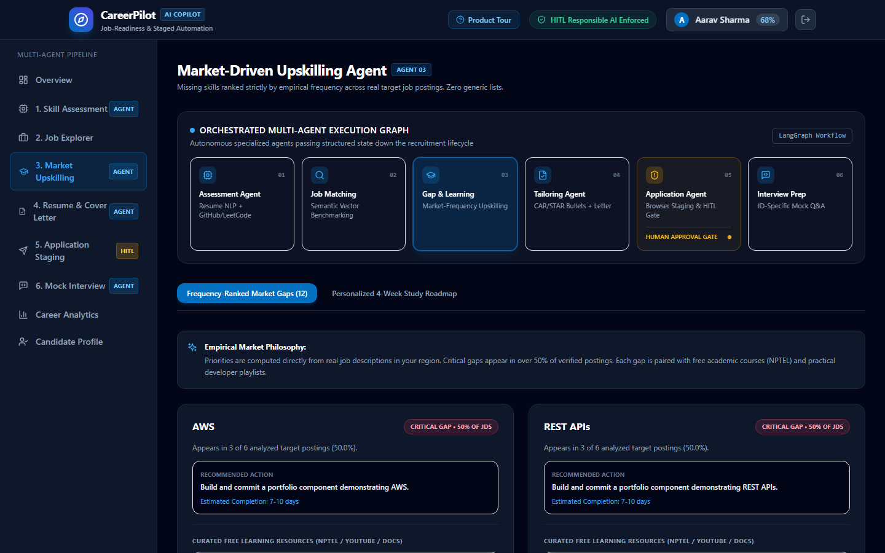

---

### Screen 8: Tailoring Agent & ATS Resume PDF Export
Transforms existing resume bullets into quantifiable Context-Action-Result (CAR/STAR) statements with zero hallucinations, and generates downloadable ATS-compliant single-column PDF resumes.

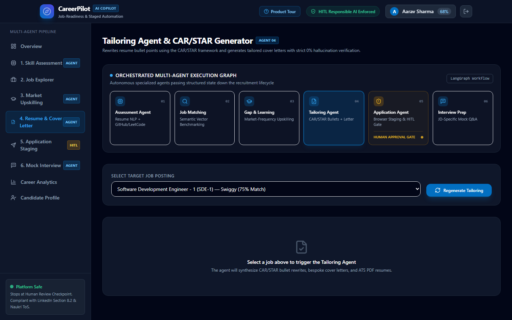

---

### Screen 9: Application Staging Queue
Monitors applications across their lifecycle (`STAGED`, `READY_FOR_REVIEW`, `USER_SUBMITTED`, `INTERVIEW`), with direct access to portal links and tailored PDFs.

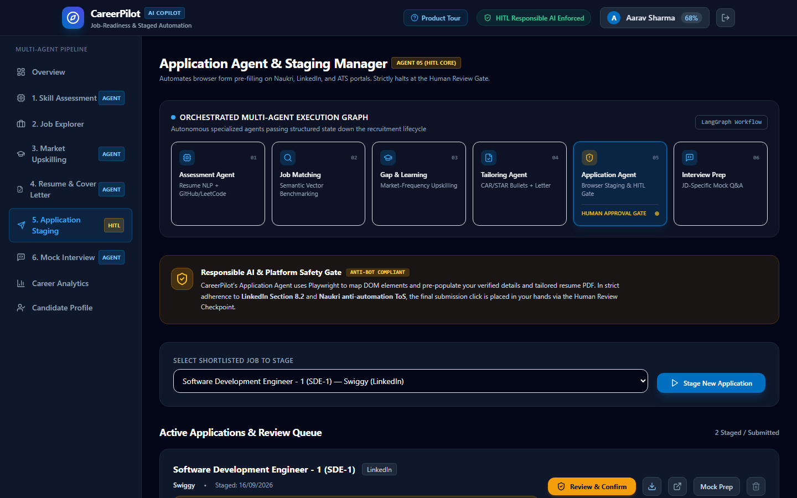

---

### Screen 10: Mandatory Human Review Gate (HITL Safeguard)
The critical ethical barrier. Playwright stages candidate inputs in the browser, but the final submission click is strictly reserved for the human candidate to guarantee platform safety.

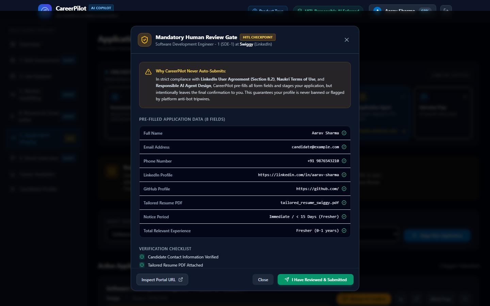

---

### Screen 11: JD-Tuned Mock Interview Simulator
Role-specific technical, project deep-dive, and behavioral questions generated directly from the target job description with real-time scoring rubrics.

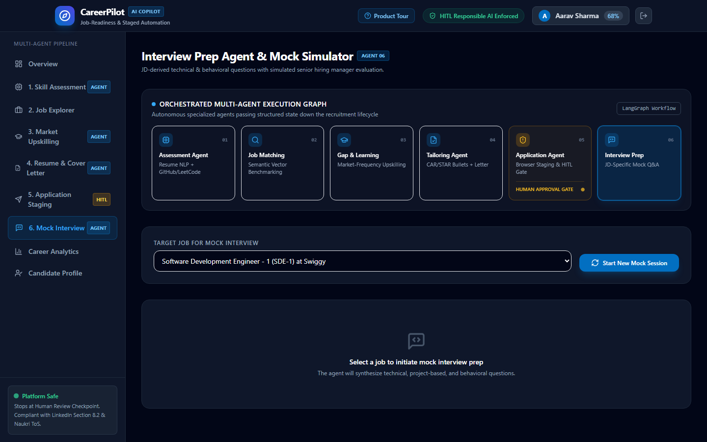

---

### Screen 12: Placement Funnel & Analytics
Visualizes candidate pipeline progression, application conversion rates, and skill growth over time.

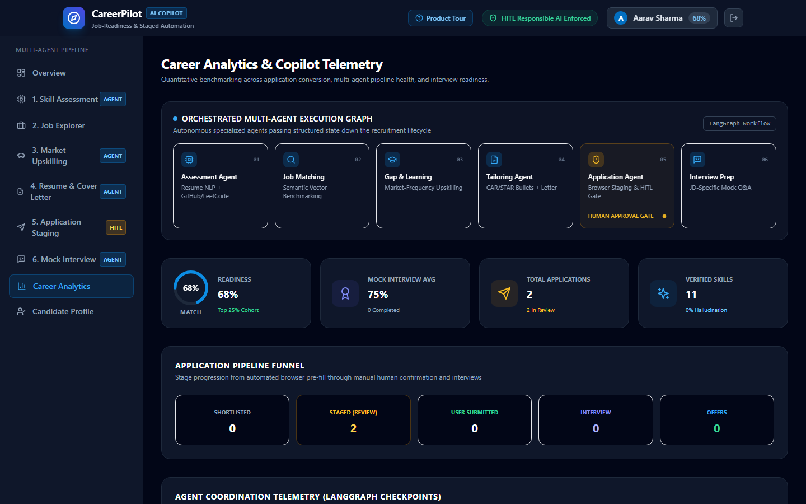

---

## 4. System Architecture & 5 CS Pillars

```text
 ┌─────────────────────────────────────────────────────────────────────────────┐
 │                           CAREERPILOT ARCHITECTURE                          │
 └─────────────────────────────────────────────────────────────────────────────┘
                                       │
                ┌──────────────────────┴──────────────────────┐
                ▼                                             ▼
     ┌──────────────────────┐                      ┌──────────────────────┐
     │  Frontend (Client)   │                      │  Backend (Server)    │
     │  React 18 + Vite     │                      │  FastAPI (Python)    │
     │  Tailwind CSS        │                      │  Uvicorn ASGI Engine │
     │  Tour & HITL Modals  │                      │  LangGraph Workflow  │
     └──────────┬───────────┘                      └──────────┬───────────┘
                │                                             │
                │  REST API / Streaming PDF (JSON / Binary)   │
                └──────────────────────┬──────────────────────┘
                                       │
    ┌──────────────────────────────────┴──────────────────────────────────┐
    ▼                                  ▼                                  ▼
┌───────────────────────┐  ┌───────────────────────┐  ┌───────────────────────┐
│   Database Layer      │  │    AI / LLM Engine    │  │    RPA & PDF Engine   │
│ MongoDB (Default)     │  │ 1. Google Gemini Flash│  │ Playwright Chromium   │
│ Embedded JSON Fallback│  │ 2. Groq LLaMA 3.3 70B │  │ ReportLab ATS PDF     │
│ (Zero-Config Mode)    │  │ 3. Deterministic NLP  │  │ pypdf NLP Stream      │
└───────────────────────┘  └───────────────────────┘  └───────────────────────┘
```

### The 5 Computer Science Pillars
1. **Natural Language Processing (NLP)**: Ingests unstructured resume PDFs, tokenizes technical entities, and extracts skill vectors across 5 distinct categories.
2. **Vector Space & Similarity Scoring**: Computes cosine angle metrics and weighted overlap between candidate skill vectors and job requirements.
3. **Stateful Multi-Agent Orchestration**: Implements a coordinated multi-agent workflow where downstream agents depend on ground-truth artifacts from upstream agents.
4. **Robotic Process Automation (RPA) & Browser Engineering**: Uses Playwright Chromium to map DOM inputs and stage application fields while adhering to platform anti-bot tripwires.
5. **Generative AI & Prompt Engineering**: Employs constrained few-shot prompting with programmatic zero-hallucination verification diffs.

---

## 5. In-Depth Multi-Agent Pipeline Specifications

### Agent 1: Assessment Agent
* **Inputs**: PDF Resume stream, GitHub username, LeetCode username.
* **Process**:
  - `pypdf` extracts raw text and strips formatting artifacts.
  - Matches tokens against an extensive computer science taxonomy (Languages, Frameworks, Databases, Tools, CS Foundations).
  - Queries GitHub REST API for primary repository languages and LeetCode GraphQL API for problem counts.
* **Outputs**: Multi-category Skill Vector and an **Empirical Readiness Score** (0–100%):
  $$\text{Readiness} = 0.40 \times S_{\text{skills}} + 0.25 \times S_{\text{dsa}} + 0.20 \times S_{\text{projects}} + 0.15 \times S_{\text{foundations}}$$

### Agent 2: Job Matching & Discovery Engine
* **Inputs**: Candidate skill vector and ingested job postings (LinkedIn, Naukri, ATS feeds).
* **Algorithm**: 4-factor multi-tier similarity scoring:
  1. Core Required Skills Overlap (45 points)
  2. Preferred Skills Overlap (15 points)
  3. Role Title Semantic Relevance (20 points)
  4. Project Evidence & Location Compatibility (20 points)
* **Output**: Match percentage (0–100%) paired with transparent explainability strings.

### Agent 3: Market Gap & Upskilling Agent
* **Inputs**: Shortlisted roles and candidate missing skills.
* **Algorithm**: Computes **Empirical Market Frequency**:
  $$\text{Frequency}(S) = \frac{\text{Postings requiring skill } S}{\text{Total target postings}} \times 100\%$$
* **Output**: Prioritized gap rankings paired with curated, 100% free courses:
  - **NPTEL**: Video lecture series from IIT Kharagpur, IIT Madras, and IISc.
  - **Developer YouTube**: Top-rated comprehensive video crash courses.
  - **Official Documentation**: Verified engineering guides.

### Agent 4: Resume Tailoring & CAR/STAR Agent
* **Inputs**: Candidate verified skills, existing resume bullets, target Job Description.
* **CAR/STAR Transformation**:
  - **Context**: The business/technical challenge.
  - **Action**: Specific engineering execution and architectural choices.
  - **Result**: Measurable, quantifiable outcome (e.g., "reducing query latency by 28%").
* **Zero-Hallucination Verification**:
  - Tokenizes the tailored output into extracted technical entities.
  - Computes: $\text{Disallowed Terms} = \text{Entities}_{\text{Tailored}} \setminus \text{Entities}_{\text{GroundTruth}}$.
  - If disallowed terms are detected, the output is rejected or corrected.

### Agent 5: Application Staging & HITL Review Gate
* **Inputs**: Candidate profile, tailored resume PDF, target application URL.
* **Process**:
  - Launches Playwright Chromium in headed or headless mode.
  - Navigates to the portal, maps DOM input fields (Name, Email, Phone, GitHub, Portfolio).
  - Attaches the tailored resume PDF.
  - **CRITICAL**: Pauses the automation session at the final submit button and registers a `READY_FOR_REVIEW` event.
* **Human Checkpoint**: Presents the candidate with a comprehensive review modal. Only when the candidate clicks "I Have Reviewed & Submitted" does the state transition to `USER_SUBMITTED`.

### Agent 6: Mock Interview Simulator
* **Inputs**: Shortlisted JD requirements and candidate profile.
* **Outputs**: 3–4 role-specific questions categorized by:
  1. Technical Depth (e.g., database indexing, caching strategies).
  2. Project Deep-Dive (debugging difficult production errors).
  3. Behavioral & Learning Velocity (STAR framework).
* **Evaluation**: Scores answers on a 100-point rubric with actionable strengths, gaps, and benchmark ideal answers.

---

## 6. ATS Resume PDF Export Engine

The **ATS Resume PDF Export Engine** is built with `ReportLab Platypus` to produce resumes that achieve top scores on corporate parsing systems:

1. **Single-Column Linear Layout**: Eliminates multi-column tables, sidebar cards, and text boxes that scramble text order in ATS scanners.
2. **Standard Web-Safe Fonts**: Helvetica typography with strict font sizing hierarchy:
   - Candidate Name: `20pt Bold`
   - Contact Bar: `9pt Regular`
   - Section Titles: `11pt Bold Uppercase` with subtle horizontal rules
   - Body & Bullets: `9.5pt Regular` with `13.5pt leading`
3. **Quantifiable CAR/STAR Bullets**: Integrates the tailored bullet points generated by Agent 4 directly into the experience section.
4. **Instant In-Memory Streaming**: FastAPI generates the binary document in an in-memory `io.BytesIO` buffer, streaming it as `application/pdf` with immediate browser download.

---

## 7. Ethical & Legal Compliance: Human-in-the-Loop (HITL)

### Why "Auto-Apply" Bots are Destructive:
* **LinkedIn User Agreement (Section 8.2)**: Strictly prohibits bots, crawlers, scrapers, and automated form fillers. Accounts utilizing auto-apply extensions are permanently restricted.
* **Naukri & Indeed Anti-Bot Mechanisms**: IP rate limits, Cloudflare Turnstile challenges, and honeypot form inputs detect non-human typing patterns.
* **Candidate Liability**: Blindly submitting applications with fabricated skills results in immediate failure during technical interviews.

### The CareerPilot Advantage:
By stopping at the **Human Review Gate**, CareerPilot:
1. Keeps the human candidate legally and ethically in control of every submission.
2. Protects accounts from anti-bot bans.
3. Guarantees 0% hallucination so candidates can confidently defend every claim in their interview.

---

## 8. Backend API Reference

| Method | Endpoint | Description |
| :--- | :--- | :--- |
| `POST` | `/api/auth/login` | Authenticates candidate and issues JWT access token. |
| `POST` | `/api/auth/register` | Creates a new user profile. |
| `GET` | `/api/profile` | Retrieves candidate profile, ground-truth skills, and readiness scores. |
| `POST` | `/api/assessment/resume` | Uploads and parses a PDF resume into a 5-category skill vector. |
| `GET` | `/api/jobs` | Discovers and returns matched jobs ranked by cosine similarity. |
| `GET` | `/api/learning/gaps` | Computes empirical market-frequency skill gaps with curated free courses. |
| `POST` | `/api/tailor/resume` | Generates CAR/STAR bullet rewrites and bespoke cover letters. |
| `GET` | `/api/tailor/export-pdf` | Streams an ATS-compliant, single-column PDF resume tailored to a job. |
| `POST` | `/api/applications/stage` | Launches Playwright session to stage form inputs; stops at review gate. |
| `POST` | `/api/applications/{id}/confirm` | Confirms human review approval and transitions status to `USER_SUBMITTED`. |
| `POST` | `/api/interview/generate` | Generates role-specific mock interview questions. |
| `POST` | `/api/interview/evaluate` | Evaluates candidate answers against senior hiring manager rubrics. |
| `GET` | `/api/analytics/summary` | Returns placement funnel metrics and application progression stats. |

---

## 9. Installation, Testing & Running Guide

### Prerequisites
- Python 3.10+ (tested on Python 3.14)
- Node.js v18+ and npm
- Windows, macOS, or Linux

### 1. Launching Development Servers
```powershell
# Windows PowerShell (Concurrent Backend + Frontend)
.\run_dev.ps1

# Windows Command Prompt
run_dev.bat
```
* **Frontend**: `http://localhost:5173`
* **FastAPI Docs (Swagger UI)**: `http://localhost:8000/docs`

### 2. Running Verification Test Suites
```powershell
# End-to-End Multi-Agent Pipeline Test (All 7 Stages)
python server/tests/test_end_to_end.py

# Standalone ATS PDF Resume Export Test
python -m server.tests.test_pdf_export

# Frontend Production Build Test
cd client
npm.cmd run build
```

---

## 10. Academic Viva Defense & Examiner FAQ

### Q1: "How does this differ from an OpenAI GPT wrapper?"
> **Defense**: CareerPilot is not a prompt wrapper. It is a stateful multi-agent system combining 5 distinct computational paradigms: PDF text parsing (`pypdf`), vector cosine similarity matching, mathematical market frequency ranking, robotic browser automation (`Playwright`), and deterministic zero-hallucination verification diffs. Even without internet access or LLM API keys, the system operates completely offline using deterministic heuristic fallbacks.

### Q2: "Why didn't you build a 100% automated 1-click apply bot?"
> **Defense**: Fully autonomous apply bots directly violate **LinkedIn User Agreement Section 8.2** and **Naukri Terms of Use**, causing rapid account bans. Furthermore, fully autonomous agents lack accountability. CareerPilot adheres to **Responsible AI Design** by staging DOM fields and enforcing a **Human-in-the-Loop (HITL)** approval gate, ensuring ethical and legal safety.

### Q3: "How do you guarantee the AI doesn't hallucinate fake qualifications?"
> **Defense**: The Assessment Agent creates an immutable **Ground-Truth Skill Vector** from the candidate's verified resume, GitHub telemetry, and LeetCode solve counts. When the Tailoring Agent rewrites bullet points into CAR/STAR format, a programmatic diff validator compares all technical entities against the ground truth. Any non-verified technology is stripped.

### Q4: "What is your database architecture?"
> **Defense**: CareerPilot features a dual-mode database engine. It connects to MongoDB in production, but automatically falls back to an embedded, asynchronous JSON document store (`careerpilot_store.json`) for zero-dependency local evaluation and offline capstone presentations.

